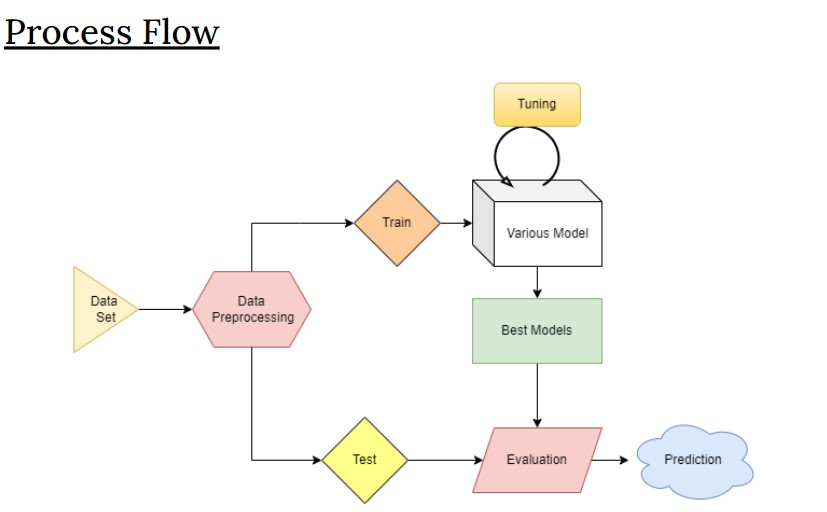

# Stress and Sleep Disorder Predictor

This project aims to predict stress and sleep disorders using machine learning models. The predictor analyzes various Lifestyle factors to determine the likelihood of stress and sleep disorders in individuals.



## How to Run
# Bash the below
    ```
    cd Code
    ```
# Make sure you are inside Code in the terminal and then run
    ```
    streamlit run run_model.py
    ```

## Model Testing and Build

The model was tested and built in a separate repository. You can find the details and the code for the model testing and building [here](https://github.com/VISHNU-SHREERAM/ML-Project).


# Credits

This project is done under the course, DS3010: Introduction to Machine Learning
at IIT Palakkad.

Team Members: <br>
    1. <a href="https://github.com/VISHNU-SHREERAM"> Vishnu Shreeram M P  </a> <br>
    2. <a href="https://github.com/cvbshcbad"> Bhupathi Varun </a> <br>
    3. <a href="https://github.com/wanderer3519"> Bhogaraju Shanmukha Sri Krishna </a> <br>

# For more information about this project
link to documentation :- https://docs.google.com/presentation/d/1MUgVDjUrzk8mMwwzn28mSKFLle8CEojJlna41vzVFp0/edit?usp=sharing 
